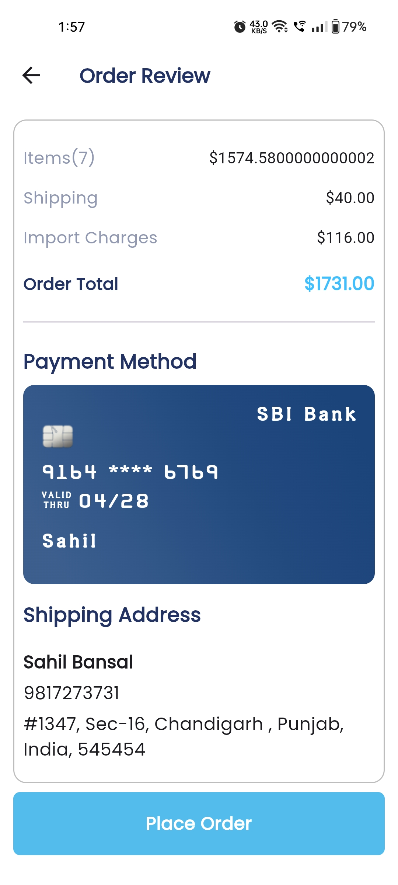

# e_commerce_app

## Table of contents

  - [Screenshot](#screenshot)
  - [Description](#description)
  - [Built with](#built-with)
  - [What I learned](#what-i-learned)
  - [Author](#author)

### Screenshot 

## Description

A E-commerce App:
• Implemented user registration and login workflows, ensuring a seamless and secure onboarding experience for users
• An e-commerce platform exclusively for buyers, offering a wide range of products for purchase
• Implemented a range of payment methods for users to explore
• Established an intuitive user interface facilitating seamless product discovery through both categorization and
  search functionalities

### Built with

- Flutter
- Cloud Firestore
- Bloc(State Management)
- Firebase Authentication
- API

### What I learned
This project really taught me many new things as it was first big project using Bloc State Management. It was an great experience building this project and running into different errors and solving them. 

## Author
- LinkedIn - [Sahil Bansal] (https://www.linkedin.com/in/%F0%9F%8E%AF-sahil-bansal-882b41272/)
- Twitter - [@Sahil121315](https://x.com/Sahil121315?t=91yHYBDE2vjBnehGdAjZ0Q&s=09)
